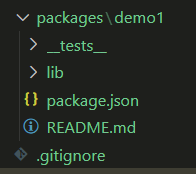
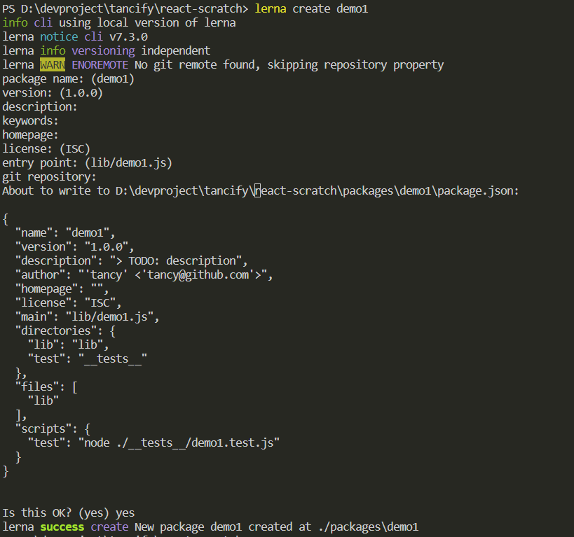
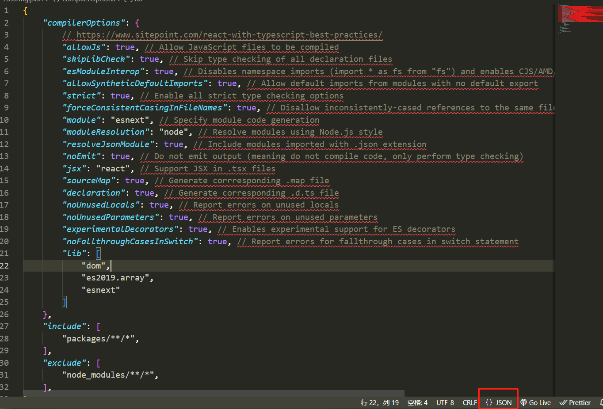
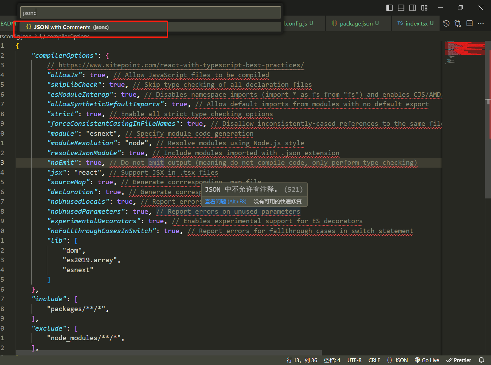
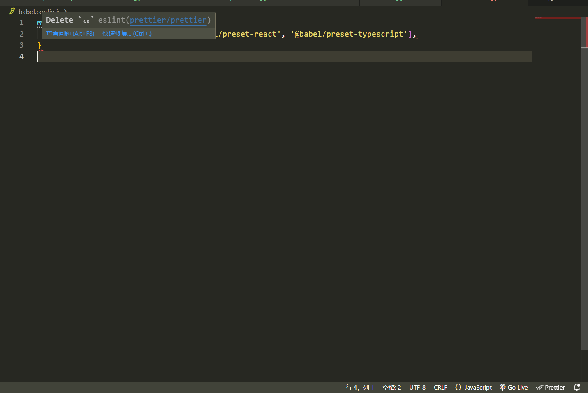
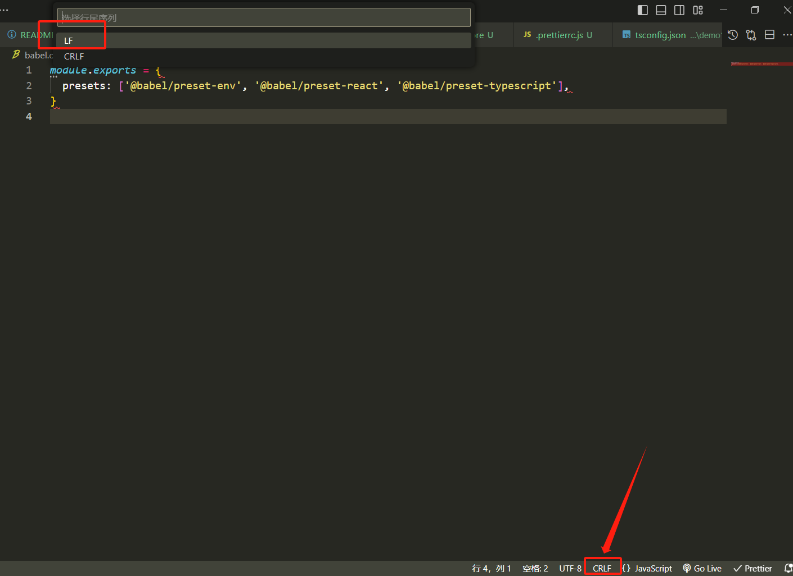

## 从零搭建一个多包工程：react18 + lerna + typescript + webpack5


### 前言
现代前端工程已经有了巨大的改变，发展出了许多新概念和工具包，当使用主流的一些脚手架搭建工程环境时（例如：[create-react-app](https://create-react-app.dev/)），对于没有完整知识体系的学习人员或新手开发者，这是个未知的庞大的“怪物”。

在我学习工程化相关知识时，从这篇文章看到了工程化最开始的样子：[creating a react app from scratch by JedaiSaboteur](https://medium.com/@JedaiSaboteur/creating-a-react-app-from-scratch-f3c693b84658) 。

于是在学习到了更多之后，我将自己的理解和实践整理到这个工程，旨在让新手或对现代前端工程化手足无措的开发者们有一个初步的认识，对搭建一个前端工程环境涉及的主要和重要的步骤有所了解。

**注意**：工程涉及的所有依赖包均采用指定版本，目的是尽可能减少版本差异带来的干扰和困惑（减少莫名其妙的问题发生）。

> 工程内容均为自己收集整理学习后的个人理解，若你在实践过程中发现错误或谬误的地方欢迎纠错指正。


### 环境

- node=18.17.0
- npm=9.6.7

如果你想执行此工程，执行以下步骤：
```bash
git clone https://github.com/yakkomajuri/react-scratch
cd react-scratch
npm i
npm run dev
```

> node 为 js 运行时环境，npm 是包管理工具并包含一系列相关操作命令（包括：安装依赖包，执行脚本等），由于相关知识不属于此工程主要目的，不再赘述，相关文档参考官方文档或自行查阅。

除了以上需要的环境，还需要一些必须的基础工具以构建运行工程，包括：
- 编译工具：[Babel](https://babeljs.io/)
- 构建打包：[Webpack](https://webpack.js.org/)

非必须但很重要的，包括：
- 格式化：[Prettier](https://prettier.io/docs/en/)
- 代码校验：[Eslint](https://eslint.org/docs/latest/)


### 1. 初始化

此步骤为可选项，如果你实际工作中不需要多包管理，则可以省略。

> 跳过此步骤后，工程目录结构稍有不同，最主要的区别就是没有 packages ，切所有必要配置文件都将在根目录下。

#### lerna 初始化工程

```bash
# 安装 lerna
npm i -g lerna@7.3.0
# 创建工程目录
mkdir react-scratch
cd ./react-scratch
# 初始化
lerna init --independent
```

> lerna 有 2 种版本管理模式：fixed 或 independent ，具体参考：https://lerna.js.org/docs/features/version-and-publish#versioning-strategies


执行完成后生成如下目录结构：
```
- .gitignore
- lerna.json
- package-lock.json
- package.json
```

说明：
1. package.json 为 npm 的配置文件（package-lock.json 为 npm 自己的维护文件，无需关注）；
2. lerna.json 为 lerna 配置文件。


#### lerna 创建子包

```bash
lerna create demo1 
```

按照提示输入内容或不输入都可以，最后生成一个子工程。目录结构如下图：






现在将子工程 demo1 做一些修改：
1. 删除 lib
2. 新建目录 src （一般项目工程都有的目录）
3. 新建 index.tsx （react+typescript 项目使用的文件后缀）
4. 修改 package.json
```json
// 修改入口文件
{
    "main": "src/index.tsx",
}
```

至此一个工程的骨架构建完成。


### babel 安装

需要安装必须的依赖包，如下：
```bash
npm i --save-dev @babel/core@7.23.0 @babel/cli@7.23.0 @babel/preset-env@7.22.20 @babel/preset-react@7.22.15 @babel/preset-typescript@7.23.0
```

最后，在根目录下新建文件 ```babel.config.js``` ，配置如下：
```js
module.exports = {
  presets: ['@babel/preset-env', '@babel/preset-react', '@babel/preset-typescript'],
}
```

>注意：如果只想将依赖包安装到 demo1 ，带上参数 -w demo1，作用是将依赖包安装到指定的 demo1 。


### typescript 安装

```bash
npm i --save-dev typescript@5.2.2
```

在根目录下新建配置文件 ```tsconfig.json``` ，参考配置如下：
```json
{
    "compilerOptions": {
        // https://www.sitepoint.com/react-with-typescript-best-practices/
        "allowJs": true, // Allow JavaScript files to be compiled
        "skipLibCheck": true, // Skip type checking of all declaration files
        "esModuleInterop": true, // Disables namespace imports (import * as fs from "fs") and enables CJS/AMD/UMD style imports (import fs from "fs")
        "allowSyntheticDefaultImports": true, // Allow default imports from modules with no default export
        "strict": true, // Enable all strict type checking options
        "forceConsistentCasingInFileNames": true, // Disallow inconsistently-cased references to the same file.
        "module": "esnext", // Specify module code generation
        "moduleResolution": "node", // Resolve modules using Node.js style
        "resolveJsonModule": true, // Include modules imported with .json extension
        "noEmit": true, // Do not emit output (meaning do not compile code, only perform type checking)
        "jsx": "react", // Support JSX in .tsx files
        "sourceMap": true, // Generate corrresponding .map file
        "declaration": true, // Generate corresponding .d.ts file
        "noUnusedLocals": true, // Report errors on unused locals
        "noUnusedParameters": true, // Report errors on unused parameters
        "experimentalDecorators": true, // Enables experimental support for ES decorators
        "noFallthroughCasesInSwitch": true, // Report errors for fallthrough cases in switch statement
        "lib": [
            "dom",
            "es2019.array",
            "esnext"
        ]
    },
    "include": [
        "packages/**/*",
    ],
    "exclude": [
        "node_modules/**/*",
    ],
}
```

所有配置均可自行修改，但部分配置建议保持不变：
```json
"noEmit": true, // Do not emit output (meaning do not compile code, only perform type checking)
"jsx": "react", // Support JSX in .tsx files
```

我们之所以应该将 noEmit 设为 true ，是因为 Babel 会编译 TypeScript ，所以我们只希望 TypeScript 来检查错误。

最后，你的 ```tsconfig.json``` 文件内**可能**会显示警告信息，这是因为普通的 json 不允许有注释文本，需要设置为 jsonc （json with comments）。这里主要说明在 Vscode 中的解决方法，在编辑器底边栏下有个“语言模式”的选项（默认JSON），点击后在输入栏输入“jsonc”选择即可。





最后，在 ```demo1``` 下也需要新建 ```tsconfig.json``` 配置文件，参考配置如下：
```json
{
    "extends": "../../tsconfig.json",
    "compilerOptions": {
        "baseUrl": "./src",
        "paths": {
            "types/*": [
                "./types/*"
            ]
        },
    },
    "include": [
        "src/**/*",
    ],
    "exclude": [
        "node_modules/**/*",
    ],
}
```


### webpack 安装

```bash
npm i --save-dev webpack@5.88.2 webpack-cli@5.1.4 webpack-dev-server@4.15.1
npm i --save-dev babel-loader@9.1.3 css-loader@6.8.1 style-loader@3.3.3
```

```webpack``` 和 ```webpack-cli``` 是主要依赖包，并提供命令行操作。

```webpack-dev-server``` 是本地开发时使用，主要功能是启动一个本地化服务器，需要执行 ```webpack serve``` 启动。（后续步骤详细说明）

最后，需要在 ```demo1``` 下新建配置文件 ```webpack.config.js``` ，参考配置如下：
```js
const path = require("path");
const webpack = require("webpack");
const babel = require("../../babel.config");

module.exports = {
  entry: "./src/index.tsx", // our entry point, as mentioned earlier
  mode: "development",
  module: {
    rules: [
      {
        test: /\.[jt]sx?$/, // matches .js, .ts, and .tsx files
        loader: "babel-loader", // uses babel-loader for the specified file types (no ts-loader needed)
        exclude: /node_modules/,
        options: {
          presets: babel.presets,
        },
      },
      {
        test: /\.css$/, // matches .css files only (i.e. not .scss, etc)
        use: ["style-loader", "css-loader"],
      },
    ],
  },
  resolve: {
    extensions: [".tsx", ".ts", ".js"],
  },
  output: {
    path: path.resolve(__dirname, "dist"),
    filename: "bundle.js", // our output bundle
    publicPath: "/",
  },
  devServer: {
    // 这是 webpack5 的配置写法，之前的版本稍有不同注意区分
    static: {
      directory: path.join(__dirname, "public"), // Tell the server where to serve the content from. This is only necessary if you want to serve static files.
      publicPath: "/", // Tell the server at which URL to serve {static.directory} content.
    },
    port: 3000,
    hot: false,
  },
  plugins: [new webpack.HotModuleReplacementPlugin()], // used for hot reloading when developing
  devtool: "eval-source-map", // builds high quality source maps
};
```

### react 安装

```bash
npm i react@18.2.0 react-dom@18.2.0
npm i --save-dev @types/react@18.2.23 @types/react-dom@18.2.8
```

```@types/react``` 和 ```@types/react-dom``` 提供对 typescript 的支持。

> 因为 typescript 编译后不存在，所以所有 typescript 相关的依赖包只设置在开发依赖项。


### prettier 安装

这是一个代码格式化工具，在 vscode 插件中搜索 ```Prettier - Code formatter``` 使编辑器支持 prettier 。

```bash
npm i --save-dev prettier@3.0.3
```

在根目录下新建配置文件 ```.prettierrc.js``` ，参考配置如下：
```js
module.exports = {
  // 箭头函数只有一个参数的时候可以忽略括号
  arrowParens: 'avoid',
  // 是否在对象字面量的花括号内添加空格
  bracketSpacing: true,
  // 行结束符使用 Unix 格式
  endOfLine: 'lf',
  // 将结束括号（>）放在同一行而不是单独一行
  bracketSameLine: false,
  // 行宽
  printWidth: 100,
  // 换行方式
  proseWrap: 'preserve',
  // 分号
  semi: false,
  // 使用单引号
  singleQuote: true,
  // 缩进
  tabWidth: 2,
  // 使用 tab 缩进
  useTabs: false,
  // 后置逗号，多行对象、数组在最后一行增加逗号
  trailingComma: 'es5',
  parser: 'typescript',
}
```

> 注意：插件是使编辑器具备安装的格式化插件的格式化能力（编写代码时使用），npm 安装是使工程自身具备格式化能力（能以脚本命令的方式格式化代码或更多高级功能）。

### eslint 安装

代码静态分析工具，帮助开发者提前发现代码规范、错误等问题。提供了 vscode 插件，搜索 ```ESLint``` 。

```bash
npm i --save-dev eslint@8.50.0
npm i --save-dev eslint-plugin-react@7.33.2
npm i --save-dev eslint-config-prettier@9.0.0 eslint-plugin-prettier@5.0.0
npm i --save-dev @typescript-eslint/eslint-plugin@6.7.3 @typescript-eslint/parser@6.7.3
```

在根目录下新建配置文件 ```.eslintrc.js``` 和 ```.eslintignore``` ，参考配置如下：
```js
module.exports = {
  env: {
    browser: true,
    es6: true,
    node: true,
  },
  extends: [
    'eslint:recommended',
    'plugin:@typescript-eslint/eslint-recommended',
    'prettier', // eslint-config-prettier 8 以后的写法
    'plugin:prettier/recommended', // Enables eslint-plugin-prettier and displays prettier errors as ESLint errors. Make sure this is always the last configuration in the extends array.
    'plugin:react/recommended',
  ],
  parser: '@typescript-eslint/parser',
  parserOptions: {
    ecmaVersion: 2018,
    sourceType: 'module',
    ecmaFeatures: {
      jsx: true,
    },
  },
  plugins: ['@typescript-eslint', 'prettier', 'react'],
  rules: {
    'no-unused-vars': 'off',
    /* Note: While it is possible to pass options to Prettier via your ESLint configuration file,
     it is not recommended because editor extensions such as prettier-atom and prettier-vscode will read .prettierrc,
     but won't read settings from ESLint, which can lead to an inconsistent experience. */
    // This option will merge and override any config set with .prettierrc.* files
    'prettier/prettier': [
      'error',
      {
        singleQuote: true,
        parser: 'typescript',
        endOfLine: 'lf',
      },
    ],
  },
}
```

```text
node_modules/*
dist/
*.html
```

配置项 ```prettier/prettier``` 会覆盖 ```.prettierrc.js``` ，这样做的目的是确保 eslint 和 prettier 配置兼容。

> 注意：插件是使编辑器具备 eslint 能力（编写代码时使用），npm 安装是使工程自身具备 eslint 能力（能以脚本命令的方式校验代码或更多高级功能）。


### vscode 工作区配置

新建工作区配置文件 ```.vscode/settings.json``` ，参考配置如下：
```json
{
    // 保存时格式化
    "editor.formatOnSave": true,
    // 默认格式化 prettier
    "editor.defaultFormatter": "esbenp.prettier-vscode",
    "editor.tabSize": 2,
    // json 文件关联为 jsonc
    "files.associations": {
        "*.json": "jsonc"
    },
    // 默认行尾字符
    "files.eol": "\n",
    // eslint 需要校验的语言
    "eslint.validate": [
        "javascript",
        "javascriptreact",
        "typescript",
        "typescriptreact",
    ],
}
```

> 工作区配置主要是方便所有成员使用统一的编辑器配置，减少编辑器不一致带来的规范问题。


**完成上述步骤后请先重启 vscode 使相关插件生效。**

重启后可能遇到的问题，某些文件可能出现警告信息 ```Delete ␍``` 。原因是在 ```.eslintrc.js``` 中设置的换行符为 ```endOfLine: 'lf'``` ，解决方法：打开出现警告信息的文件，在 vscode 底边栏点击“行尾序列”选项，选择 ```LF``` 即可。






### 本地服务启动脚本配置

这里的启动服务指的是启动 ```demo1``` 以显示页面。

修改配置文件 ```demo1/package.json``` ，配置如下：

```json
{
  "scripts": {
    "test": "node ./__tests__/demo1.test.js",
    "dev": "webpack serve --mode development"
  },
}
```

修改根目录配置文件 ```package.json``` ，配置如下：（目的是方便直接在根目录下就能执行启动 ```demo1``` 的命令）
```json
{
  "scripts": {
    "dev": "cd ./packages/demo1 && npm run dev"
  },
}
```

### 开始创建你的第一个 APP

1. 新建 ```./packages/demo1/public/index.html``` 文件

react 将用这个 html 文件渲染内容。

```html
<!DOCTYPE html>
<html>

<head>
    <meta charset="UTF-8" />
    <meta name="viewport" content="width=device-width, initial-scale=1, shrink-to-fit=no" />
    <title>React Scratch BY Tancy</title>
</head>

<body>
    <div id="root"></div>
    <noscript> You need to enable JavaScript to access this website. </noscript>
    <script src="./bundle.js"></script>
</body>

</html>
```

关键的地方：
- ```<div id="root"></div>``` ，react 渲染内容就会根据 ```id="root"``` 挂载这个元素上面；
- ```<script src="./bundle.js"></script>``` ，这个指定的是 webpack 打包输出的 js 文件。


2. 新建一个组件文件 ```./packages/demo1/components/MyComponent.tsx```

```js
import React from "react"

function MyComp(){
  return (<div><span>恭喜你完成了一个了不起的成就——捕获了这只“怪物”！</span></div>)
}

export default MyComp
```

3. 新建 App 文件 ```./packages/demo1/App.tsx```

```js
import React from 'react'
import MyComp from './components/MyComponent'

export function _App(): JSX.Element | null {
  return (
    <div>
      <MyComp />
    </div>
  )
}

export const App = _App
```

4. 修改或新建入口文件 ```./packages/demo1/index.tsx```

```js
import React from 'react'
import { createRoot } from 'react-dom/client'
import { App } from './App'

const container = document.getElementById('root')
if (container != null) {
  const root = createRoot(container)
  root.render(<App />)
}
```

5. 启动服务

```bash
npm run dev
```


**至此，你完成了搭建一个现代前端工程主要的步骤！**


### 遇到的问题

1. eslint 安装配置后没有生效，报错如下：

```js
ESLint: 8.50.0

Error: Cannot read config file: 
.\node_modules\eslint-config-prettier\@typescript-eslint.js
Error: "prettier/@typescript-eslint" has been merged into "prettier" in eslint-config-prettier 8.0.0. See: https://github.com/prettier/eslint-config-prettier/blob/main/CHANGELOG.md#version-800-2021-02-21
Referenced from: .\.eslintrc.js
    at Object.<anonymous> (.\node_modules\eslint-config-prettier\@typescript-eslint.js:1:7)
    at Module._compile (node:internal/modules/cjs/loader:1256:14)
    at Module._extensions..js (node:internal/modules/cjs/loader:1310:10)
    at Module.load (node:internal/modules/cjs/loader:1119:32)
    at Module._load (node:internal/modules/cjs/loader:960:12)
    at Module.require (node:internal/modules/cjs/loader:1143:19)
    at module.exports [as default] (.\node_modules\import-fresh\index.js:32:59)
    at loadJSConfigFile (.\node_modules\@eslint\eslintrc\dist\eslintrc.cjs:2574:47)
    at loadConfigFile (.\node_modules\@eslint\eslintrc\dist\eslintrc.cjs:2658:20)
    at ConfigArrayFactory._loadConfigData (.\node_modules\@eslint\eslintrc\dist\eslintrc.cjs:2975:42)
```

原因：eslint-config-prettier 8 以后的版本官方修改了配置文件，都合并到 ```prettier``` 里面了。所以需要修改如下：

```js
# 旧版本的配置
{
  extends: [
    "some-other-config-you-use",
    "prettier",
    "prettier/@typescript-eslint",
    "prettier/babel",
    "prettier/flowtype",
    "prettier/react",
    "prettier/standard",
    "prettier/unicorn",
    "prettier/vue"
  ]
}
# 新版本的配置
{
  extends: [
    "some-other-config-you-use",
    "prettier"
  ]
}
```


### 最后

这就是我学习实践的整个过程，希望对你们有所帮助和收获。这只是个简单的学习工程，并不能指导你的正式项目，还有许多忽略的地方不够详尽，也还有许多值得补充进来的工具，后续会考虑逐步完善补充。（但我不想最后导致工程过于庞大，这背离了我的初衷，也不利于初学者。）

你如果遇到任何问题，或者反馈意见，可以在此工程提交问题。


### TODO

待定···


### 参考资料
1. [creating a react app from scratch by JedaiSaboteur](https://medium.com/@JedaiSaboteur/creating-a-react-app-from-scratch-f3c693b84658)
2. [Building a Modern React App from Scratch by yakkomajuri](https://github.com/yakkomajuri/react-from-scratch)